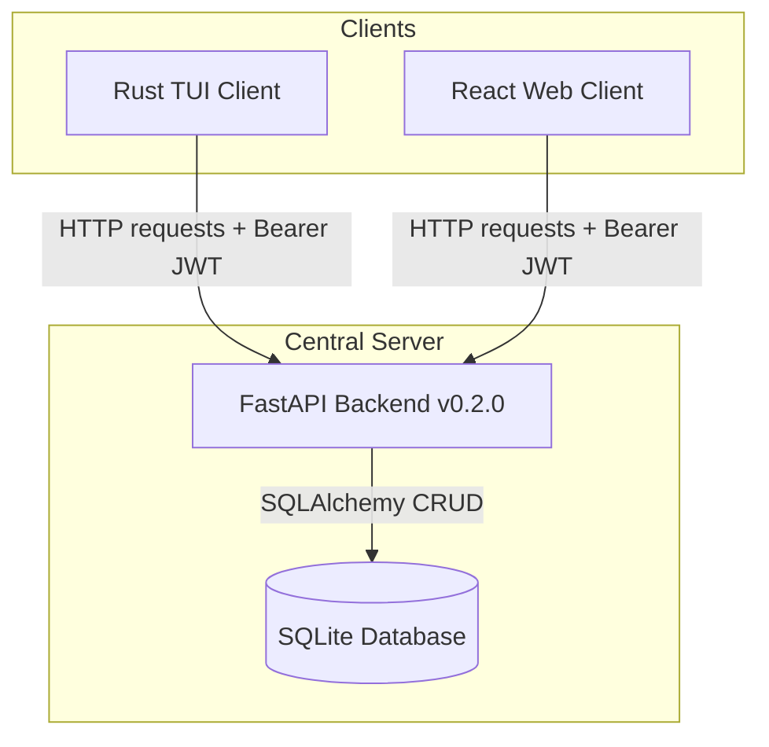

# Cartographer

A comprehensive, multi-client restaurant directory system. The application is built around a centralized **Python FastAPI** backend (v0.2.0) connected to an SQLite database, supporting **JWT user authentication**, **Role-Based Access Control (RBAC)** with three roles, and two independent interface clients:

1. **Rust TUI Client:** A terminal-based dashboard (`ratatui` + `crossterm`).
2. **React Web UI Client:** A modern glassmorphic Single Page Application (`vite` + `typescript`).

---

## System Architecture



---

## User Roles & Permissions

Upon database startup, two default accounts are auto-seeded:

| Role | Default Credentials | Permissions |
|------|-------------------|-------------|
| **Admin** | `admin` / `adminpassword` | Full CRUD on all restaurants; approve/reject submitted restaurants and location changes; manage all records |
| **Customer** | *(signup required)* | Restaurant owners. Submit restaurants for admin approval, update own restaurant info (except name), toggle own open/closed status, request location changes |
| **Consumer** | `consumer` / `consumerpassword` | End users. View approved restaurants, browse directory, manage personal favorites list |

---

## Client Feature Parity

The TUI and Web UI are two faces of the same product and are kept in strict feature parity. Every capability available in one client is available in the other. Presentation differences (keyboard shortcuts vs. buttons, list+pane vs. table) are expected — capability gaps are not. When a new backend endpoint is added, **both clients must be updated in the same change**. See `.agents/AGENTS.md` for the full parity policy and feature baseline table.

---

## Getting Started

### Prerequisites
* **Python** (version >= 3.10) with `uv` package manager installed.
* **Rust & Cargo** (for building/running the TUI client).
* **Node.js & npm** (for building/running the Web client).

---

## 1. Central Backend (Python FastAPI)

The backend handles JWT encoding, password hashing via `bcrypt`, and all database transactions via SQLAlchemy.

### API Endpoints

| Method | Path | Auth | Description |
|--------|------|------|-------------|
| `POST` | `/auth/signup` | None | Register a new user (default role: Consumer) |
| `POST` | `/auth/login` | None | Authenticate and receive JWT token |
| `POST` | `/auth/reset-password` | None | Reset password by username |
| `GET` | `/restaurants` | Any authenticated | List restaurants with filters |
| `GET` | `/restaurants/{id}` | Any authenticated | Get single restaurant detail |
| `POST` | `/restaurants` | Admin | Create restaurant (auto-approved) |
| `PUT` | `/restaurants/{id}` | Admin / Customer (own) | Update restaurant (Customer cannot change name) |
| `PATCH` | `/restaurants/{id}/status` | Admin / Customer (own) | Toggle open/closed status |
| `DELETE` | `/restaurants/{id}` | Admin | Delete a restaurant |
| `POST` | `/restaurants/submit` | Customer | Submit restaurant for admin approval |
| `PATCH` | `/restaurants/{id}/approve` | Admin | Approve or reject a submitted restaurant |
| `PATCH` | `/restaurants/{id}/approve-location` | Admin | Approve or reject a pending location change |
| `GET` | `/me/restaurants` | Customer | List own submitted restaurants |
| `GET` | `/favorites` | Consumer | List own favorites |
| `POST` | `/favorites` | Consumer | Add a restaurant to favorites |
| `DELETE` | `/favorites/{id}` | Consumer | Remove a favorite |

### API Query Filters

`GET /restaurants` supports the following optional query parameters:

| Parameter | Type | Description |
|---|---|---|
| `name` | `string` | Partial, case-insensitive name search |
| `restaurant_type` | `string` | Exact match: `Food Stall`, `Food Truck`, `Food Cart`, `Brick and mortar Restaurant` |
| `cuisine_type` | `string` | Partial, case-insensitive cuisine search |
| `menu_items` | `string` | Partial, case-insensitive menu items search |
| `open_time` | `HH:MM:SS` | Exact open time match |
| `close_time` | `HH:MM:SS` | Exact close time match |
| `open_status` | `bool` | Filter by manually-toggled open/closed flag |
| `is_open_at` | `HH:MM:SS` | Returns restaurants open at the given time, including those trading past midnight |
| `is_approved` | `bool` | Filter by approval status (Admin: all; Customer: respects filter; Consumer: forced `true`) |
| `skip` / `limit` | `int` | Pagination offsets (defaults: `0` / `100`) |

### Running the Backend Server
```bash
# Sync dependencies and configure virtual environment
make setup

# Run the FastAPI server in hot-reload mode (binds to http://127.0.0.1:8000)
make run
```

### Checking and Testing
```bash
# Run pytest automated test suite (53 tests)
make test

# Run tests and generate a branch-coverage report (must stay >= 90%)
make coverage

# Run strict mypy type checking
make typecheck

# Lint the codebase using Ruff
make lint

# Auto-format code using Ruff
make format
```

---

## 2. Rust TUI Client (`tui_client`)

A native keyboard-driven terminal dashboard built with `ratatui` and `crossterm`.

### Running the TUI Client
*(Note: Running this target will automatically verify if the FastAPI backend is active and spin it up in the background if needed)*
```bash
# Build and run the Rust TUI client locally
make run-tui
```

### Keyboard Navigation & Controls
* **Global Navigation:**
  * `[Ctrl+S]` - Go to Signup view (from Login screen).
  * `[Ctrl+R]` - Go to Reset Password view (from Login screen).
  * `[Ctrl+L]` - Logout and return to Login screen.
  * `[Esc]` - Go back to Login / Cancel active form additions.
* **Dashboard Screen:**
  * `[Tab]` - Cycle active panel focus (Search Input -> Restaurant List -> Details Card).
  * `[Up / Down]` - Navigate restaurant selection list.
  * `[S]` - Quick focus Search filter input (type to filter names dynamically).
* **Admin Actions (Admin role):**
  * `[A]` - Create a new restaurant entry (opens Add form).
  * `[E]` - Edit details of selected restaurant (opens Edit form).
  * `[T]` - Toggle the open status of the selected entry immediately.
  * `[D]` - Delete selected entry from the database.
* **Customer Actions (Customer role):**
  * `[E]` - Edit details of own restaurant.
  * `[T]` - Toggle open status of own restaurant.

### Running TUI Tests
```bash
cargo test --manifest-path tui_client/Cargo.toml
```

---

## 3. React Web Client (`web_client`)

A responsive SPA built on React, styled with glassmorphic CSS rules.

### Running the Web Dev Server
*(Note: Running this target will automatically verify if the FastAPI backend is active and spin it up in the background if needed)*
```bash
# Install package dependencies
make setup-web

# Launch Vite hot-reload development server (runs on http://localhost:5173)
make run-web
```

### Hosting Static Files via FastAPI
FastAPI can serve the web client directly from the API port. To do this, compile the assets first:
```bash
# Compile and build production assets into web_client/dist
make build-web
```
Now, when you run `make run`, the FastAPI backend will host the React app directly at root path `http://localhost:8000/`.

### Running Web Tests
```bash
make test-web
```

---

## Project Structure

```text
├── app/                  # FastAPI Backend Source
│   ├── __init__.py       # Package init
│   ├── crud.py           # Database transaction queries, password hashing, favorites
│   ├── database.py       # SQLAlchemy engine & SQLite config
│   ├── main.py           # FastAPI routes, JWT auth logic, static mounts, startup seeding
│   ├── models.py         # SQLAlchemy ORM schemas (Restaurant, User, UserRole, Favorite)
│   └── schemas.py        # Pydantic schemas for serialization
├── docs/                 # Design documentation
│   └── initial_plan.md   # Original project plan
├── tests/                # Backend test modules (53 tests, 97.2% branch coverage)
│   ├── __init__.py
│   ├── conftest.py       # In-memory SQLite fixtures, dependency overrides
│   └── test_restaurants.py # Integration tests for all API routes
├── tui_client/           # Rust Terminal Client Source
│   ├── src/
│   │   ├── api.rs        # HTTP reqwest wrapper for FastAPI
│   │   ├── ui.rs         # Widget layouts & rendering routines
│   │   └── main.rs       # Entrypoint, key event loops, & unit tests
│   └── Cargo.toml
├── web_client/           # React SPA Client Source
│   ├── src/
│   │   ├── api.ts        # Fetch wrapper with localStorage token caching
│   │   ├── App.tsx       # Main page controller & views
│   │   ├── index.css     # Glassmorphic layout stylesheets
│   │   ├── setupTests.ts # Mocking globals for tests
│   │   └── App.test.tsx  # React testing library unit tests
│   ├── package.json
│   └── vite.config.ts
├── Makefile              # Standard workspace tasks definitions
├── pyproject.toml        # Python deps (uv), mypy, ruff, pytest, coverage config
└── .agents/
    └── AGENTS.md         # Developer guidelines & AI agent rules
```
