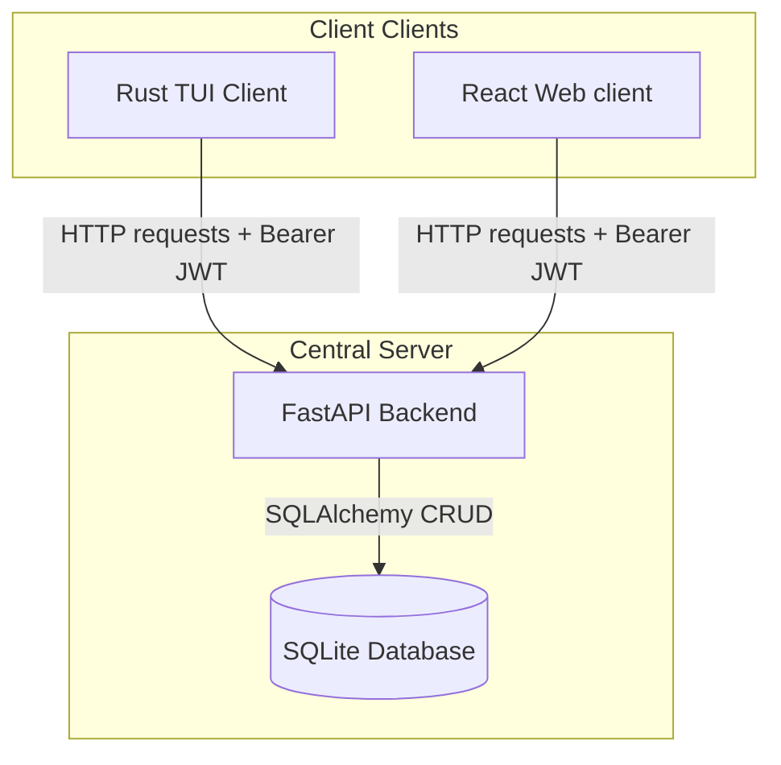

# 🧭 CART_OGRAPHER

A comprehensive, multi-client system designed to track, schedule, and route local food vendors (food stalls, food trucks, and brick-and-mortar restaurants). 

The application is built around a centralized **Python FastAPI** backend connected to an SQLite database, supporting **JWT user authentication**, **Role-Based Access Control (RBAC)**, and two independent interface clients:
1. 🦀 **Rust TUI Client:** A blazing-fast, terminal-based dashboard (`ratatui` + `crossterm`).
2. ⚛️ **React Web UI Client:** A modern, glassmorphic Single Page Application (`vite` + `typescript`).

---

## 🏛️ System Architecture



---

## 🔑 User Roles & Permissions

Upon database startup, two default accounts are auto-seeded:
* **Admin Role (`admin` / `adminpassword`):** Full CRUD permissions. Can add new entries, edit details, toggle active open/closed status, and delete records.
* **Customer Role (`customer` / `customerpassword`):** Read-only permissions. Can view list, search names, and see operating hours and location details.

---

## 🚀 Getting Started

### Prerequisites
* **Python** (version $\ge$ 3.10) with `uv` package manager installed.
* **Rust & Cargo** (for building/running the TUI client).
* **Node.js & npm** (for building/running the Web client).

---

## 📦 1. Central Backend (Python FastAPI)

The backend handles JWT encoding, user passwords hashing via `bcrypt`, and database transactions.

### Running the Backend Server
```bash
# Sync dependencies and configure virtual environment
make setup

# Run the FastAPI server in hot-reload mode (binds to http://127.0.0.1:8000)
make run
```

### Checking and Testing
```bash
# Run pytest automated test suite
make test

# Run strict mypy type checking
make typecheck

# Lint the codebase using Ruff
make lint
```

---

## 🖥️ 2. Rust TUI Client (`tui_client`)

A native keyboard-driven terminal dashboard built with `ratatui` and `crossterm`.

### Running the TUI Client
```bash
# Build and run the Rust TUI client locally
make run-tui
```

### Keyboard Navigation & Controls
* **Global Navigation:**
  * `[Ctrl+S]` - Go to Signup view (from Login screen).
  * `[Ctrl+R]` - Go to Reset Password view (from Login screen).
  * `[Ctrl+L]` - Logout and return to Login screen.
  * `[Esc]` - Go back to Login / Cancel active form additions.
* **Dashboard Screen:**
  * `[Tab]` - Cycle active panel focus (Search Input $\rightarrow$ Restaurant List $\rightarrow$ Details Card).
  * `[↑ / ↓]` - Navigate restaurant selection list.
  * `[S]` - Quick focus Search filter input (type to filter names dynamically).
* **Admin Actions (Only available for logged-in Admins):**
  * `[A]` - Create a new restaurant entry (opens Add form).
  * `[E]` - Edit details of selected restaurant (opens Edit form).
  * `[T]` - Toggle the open status of the selected entry immediately.
  * `[D]` - Delete selected entry from the database.

### Running TUI Tests
```bash
cargo test --manifest-path tui_client/Cargo.toml
```

---

## 🌐 3. React Web Client (`web_client`)

A responsive SPA built on React, styled with glassmorphic CSS rules.

### Running the Web Dev Server
```bash
# Install package dependencies
make setup-web

# Launch Vite hot-reload development server (runs on http://localhost:5173)
make run-web
```

### Hosting Static Files via FastAPI
 Fast API can serve the web client directly from the API port. To do this, compile the assets first:
```bash
# Compile and build production assets into web_client/dist
make build-web
```
Now, when you run `make run`, the FastAPI backend will host the React app directly at root path `http://localhost:8000/`.

### Running Web Tests
```bash
make test-web
```

---

## 📂 Project Structure

```text
├── app/                  # FastAPI Backend Source
│   ├── crud.py           # Database transaction queries & password hashing
│   ├── database.py       # SQLAlchemy engine & SQLite config
│   ├── main.py           # FastAPI routes, JWT auth logic, & static mounts
│   ├── models.py         # SQLAlchemy schemas (Restaurant, User, UserRole)
│   └── schemas.py        # Pydantic schemas for serialization
├── tests/                # Backend test modules
├── tui_client/           # Rust Terminal Client Source
│   ├── src/
│   │   ├── api.rs        # HTTP reqwest wrapper for FastAPI
│   │   ├── ui.rs         # Widget layouts & rendering routines
│   │   └── main.rs       # Entrypoint, key event loops, & unit tests
│   └── Cargo.toml
├── web_client/           # React SPA Client Source
│   ├── src/
│   │   ├── api.ts        # Fetch wrapper with localStorage token caching
│   │   ├── App.tsx       # Main page controller & views
│   │   ├── index.css     # Glassmorphic layout stylesheets
│   │   ├── setupTests.ts # Mocking globals for tests
│   │   └── App.test.tsx  # React testing library unit tests
│   ├── package.json
│   └── vite.config.ts
└── Makefile              # Standard workspace tasks definitions
```
